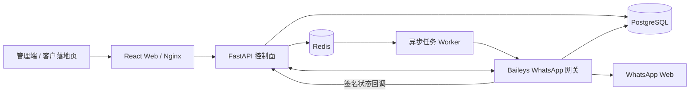

# Parloq Flow

Parloq Flow 是一套面向出海推广与 WhatsApp 个人账号运营的管理系统。系统覆盖推广落地页、账号接入、账号资源管理、超链营销、代理 IP、短链、数据统计和后台权限，并将业务控制面与 WhatsApp 连接/发送数据面分离。

本项目是独立的新系统，不是旧 WABA 控制台的改名版本。生产环境也使用独立的 Compose 项目、端口和持久化目录，不得与旧系统混用。

> 默认本地环境只运行确定性的 WhatsApp Mock 引擎，不会连接真实账号。只有在明确使用一次性测试账号和固定代理时，才允许切换到真实 Baileys 引擎。

## 目录

- [系统能力](#系统能力)
- [架构与数据边界](#架构与数据边界)
- [技术栈](#技术栈)
- [项目结构](#项目结构)
- [本地快速启动](#本地快速启动)
- [本地开发与调试](#本地开发与调试)
- [配置说明](#配置说明)
- [测试与交付检查](#测试与交付检查)
- [生产部署](#生产部署)
- [推广模板示例](#推广模板示例)
- [开发约定](#开发约定)
- [文档索引](#文档索引)

## 系统能力

### 推广管理

- 上传、预览和管理多语言推广模板；
- 配置推广渠道、客户域名、子域名和访问路径；
- 收集页面访问、停留、手机号线索、配对和账号验证事件；
- 管理 Meta Pixel/CAPI 配置、广告数据、渠道统计和趋势；
- 通过落地页引导访客使用手机号配对，并在验证成功后进入统一账号池。

### 账号与资源中心

- 通过落地页或 Baileys JSON/完整会话包接入账号；
- 管理账号分组、导入、导出、生命周期和每日统计；
- 管理协议节点的接入、营销和在线开关；
- 为账号分配固定 HTTP/SOCKS 代理，支持隔离、复用和健康策略；
- 区分 `disconnect` 与 `logout`：前者保留会话，后者解除链接并删除会话。

### 营销与运营

- 管理超链任务、数据包、模板、策略、素材和市场洞察；
- 使用 Redis 队列和独立 Worker 异步执行发送任务；
- 使用 Bitly 生成并保存直接短链，不引入自建多级跳转链路；
- 管理用户、角色、菜单权限和系统级平台配置。

## 架构与数据边界



- **Web**：提供管理后台、推广页入口以及生产环境的反向代理边界。
- **API**：负责租户、权限、配置、推广、账号元数据、任务定义和统计查询。
- **API Worker**：从 Redis 获取任务，执行有界批处理和发送编排。
- **Baileys 网关**：负责配对、连接恢复、代理应用、账号内有序发送和回执归一化。
- **PostgreSQL**：保存业务数据、网关账号状态、Baileys 凭据和 Signal Key Store。
- **Redis**：用于任务队列、登录保护、短期协调和 Worker 心跳。

系统只保存运营和统计必需的标识、排队/发送/送达时间及失败分类，不保存入站消息、回复正文、完整聊天记录或下载的入站媒体。WhatsApp 会话属于高敏感数据，生产数据库和备份必须加密并采用最小权限访问。

更完整的容量、账号状态机、代理隔离和会话持久化设计见 [系统架构](docs/architecture.md)。

## 技术栈

| 层 | 主要技术 |
| --- | --- |
| 管理端 | React 18、TypeScript、Vite 6、Tailwind CSS 4 |
| API | Python 3.12、FastAPI、SQLAlchemy、Alembic |
| WhatsApp 网关 | Node.js 22、TypeScript、Baileys、Fastify |
| 数据 | PostgreSQL 16、Redis 7 |
| 运行与发布 | Docker Compose v2、Docker Buildx、Nginx、宝塔 Docker 编排 |

## 项目结构

```text
parloq-flow/
├── apps/
│   ├── api/                         # FastAPI、Worker、Alembic 和 API 测试
│   └── web/                         # React 管理端与生产 Nginx 配置
├── services/
│   └── wa-gateway-baileys/          # 当前生产 WhatsApp 数据面
├── deploy/                          # 生产 Compose、服务器本机更新及基础设施工具
├── docs/                            # 架构、ID、模板和生产交接文档
├── docker-compose.yml               # 仅用于本地开发
└── .env.example                     # 本地环境变量模板
```

## 本地快速启动

### 前置条件

- Docker Desktop；
- Docker Compose v2；
- 建议至少预留 4 GB 可用内存；
- 首次构建需要访问 Docker Hub、npm 和 Python 包源。

仅使用 Compose 时不需要在宿主机安装项目运行时；单独开发或执行完整测试时，还需要 Python 3.12+、Node.js 20+ 和 npm。

### 1. 创建本地配置

```bash
cp .env.example .env
```

`.env.example` 中的账号、密码和密钥仅供本机开发。任何共享环境都必须替换默认值。

### 2. 启动完整开发栈

```bash
docker compose up --build
```

需要后台运行时：

```bash
docker compose up -d --build
docker compose ps
```

### 3. 登录系统

打开 <http://localhost:5173>，使用本地默认管理员：

- 用户名：`admin`
- 密码：`admin`

### 本地服务

| 服务 | 地址 | 说明 |
| --- | --- | --- |
| Web 管理端 | <http://localhost:5173> | Vite 开发服务器 |
| API | <http://localhost:8000> | FastAPI |
| API 文档 | <http://localhost:8000/docs> | OpenAPI/Swagger UI |
| 存活检查 | <http://localhost:8000/healthz> | 仅检查 API 进程 |
| 就绪检查 | <http://localhost:8000/readyz> | 检查数据库、Redis 和 Worker |
| WhatsApp 网关 | <http://localhost:8010/healthz> | 默认 `WA_ENGINE=mock` |
| PostgreSQL | `localhost:5432` | 本地命名卷持久化 |
| Redis | `localhost:6379` | 本地开发数据不持久化 |

如果端口冲突，请在 `.env` 中修改 `WEB_PORT`、`API_PORT`、`WA_GATEWAY_PORT`、`POSTGRES_PORT` 或 `REDIS_PORT`，不要直接修改 Compose 文件。

## 本地开发与调试

### 常用命令

```bash
# 查看所有服务状态
docker compose ps

# 持续查看应用日志
docker compose logs -f web api api-worker wa-gateway

# 重建并更新应用服务
docker compose up -d --build web api api-worker wa-gateway

# 停止并移除容器，保留 PostgreSQL 数据
docker compose down
```

只有在明确需要清空**本地**数据库时才执行：

```bash
docker compose down -v
```

该命令会删除本地 PostgreSQL 命名卷，不能恢复；生产环境严禁使用。

### WhatsApp Mock 与真实 Baileys

本地默认配置是：

```dotenv
WA_ENGINE=mock
```

Mock 会保留 API、数据库和状态流转边界，但不会联系 WhatsApp。真实配对测试必须同时满足：

1. 使用可丢弃的测试 WhatsApp 账号；
2. 为账号配置固定代理；
3. 明确将 `WA_ENGINE` 改为 `baileys`；
4. 只运行范围受控的配对、连接和发送验证；
5. 测试后恢复 `WA_ENGINE=mock`。

真实引擎没有官方 SLA，可能触发账号限制。接口、会话导入导出和配对说明见 [Baileys 网关文档](services/wa-gateway-baileys/README.md)。

### 单独运行 API

通常优先使用 Docker Compose。确需独立调试 API 时：

```bash
cd apps/api
python3 -m venv .venv
source .venv/bin/activate
python -m pip install -e '.[dev]'

BITLY_MOCK=true \
WA_GATEWAY_MOCK=true \
TASK_QUEUE_MOCK=true \
DATABASE_URL=sqlite+pysqlite:///./dev.db \
uvicorn app.main:app --reload
```

异步任务 Worker 需要另开终端，并使用可访问的 Redis 与相同业务配置：

```bash
cd apps/api
python -m app.task_worker
```

## 配置说明

本地配置以 [.env.example](.env.example) 为准，生产配置模板为 [deploy/production.env.example](deploy/production.env.example)。主要配置分为：

| 类别 | 关键变量 |
| --- | --- |
| 运行环境 | `APP_ENV`、`COMPOSE_PROJECT_NAME`、各服务端口 |
| 数据服务 | `DATABASE_URL`、`REDIS_URL`、`POSTGRES_*` |
| 登录安全 | `APP_SECRET_KEY`、`LOGIN_SECURITY_ENABLED`、`TURNSTILE_*` |
| 数据加密 | `DATA_ENCRYPTION_ACTIVE_KEY_ID`、`DATA_ENCRYPTION_KEYS` |
| WhatsApp | `WA_ENGINE`、`WA_GATEWAY_*` |
| 任务执行 | `TASK_QUEUE_MOCK`、`TASK_WORKER_MAX_CONCURRENCY` |
| 推广与域名 | `DOMAIN_*`、`PROMOTION_INGRESS_HOST`、`PROMOTION_SUCCESS_WEBHOOK_SECRET` |
| 外部平台 | `BITLY_MOCK`、`IP_PROXY_MOCK`、`META_CAPI_*` |
| ID 写入节点 | `API_SNOWFLAKE_NODE_ID`、`WORKER_SNOWFLAKE_NODE_ID`、`WA_GATEWAY_SNOWFLAKE_NODE_ID` |

生产模式会执行失败即停的安全检查，包括密钥长度、默认密码、HTTPS CORS、Turnstile、数据加密密钥和 Mock 开关。不要把真实密码、Token、代理凭据、WhatsApp 凭据或会话 JSON 写入仓库、日志或工单。

## 测试与交付检查

### API 测试

```bash
cd apps/api
python3 -m venv .venv
source .venv/bin/activate
python -m pip install -e '.[dev]'
python -m pytest
```

### Web 生产构建

```bash
cd apps/web
npm ci
npm run build
```

### Baileys 网关测试与构建

```bash
cd services/wa-gateway-baileys
npm ci
npm test
npm run build
```

自动化测试不会连接真实 WhatsApp 账号。

### 部署工具与 Compose 校验

在仓库根目录执行：

```bash
python3 -m unittest deploy/test_baota_api.py
docker compose --env-file .env.example config --quiet
```

涉及部署的改动，在交付前应同时通过 API 测试、Web 生产构建、Baileys 网关测试/构建和解析后的 Compose 校验。

## 生产部署

### 部署模型

生产环境不使用根目录的 `docker-compose.yml`，而使用 [deploy/docker-compose.production.yml](deploy/docker-compose.production.yml)。两套环境的区别如下：

| 项目 | 本地开发 | 生产环境 |
| --- | --- | --- |
| Compose 文件 | `docker-compose.yml` | `deploy/docker-compose.production.yml` |
| 镜像 | Compose 现场构建 | 生产服务器从本机仓库源码现场构建 |
| WhatsApp 引擎 | `mock` | `baileys` |
| 数据库 | Docker 命名卷 | 独立宿主持久化目录 |
| Redis | 临时数据 | AOF 持久化 |
| 对外端口 | 多个开发端口 | 仅 Web 绑定 `127.0.0.1:18100` |
| 数据迁移 | 开发自动建表 | API 启动时先运行 Alembic |
| 写入控制面 | 本地 Docker | 服务器本机 Docker Compose（沿用宝塔编排目录） |

管理入口为 <https://center.parloq.com>。固定服务器、宝塔记录、目录、站点、反代、证书和客户域名接入方式统一维护在 [生产部署与交接文档](docs/production-deployment.md)，不要在多个文档中维护易过期的副本。

### 首次配置私有仓库

生产脚本使用 GitHub Token 在服务器仓库执行只读 Git 操作。`/root/parloq-flow`
始终保留为 `main` 发布控制器；选中的远程分支检出到相邻 worktree 后作为 Compose
build context，不会在镜像构建时再次从 GitHub 下载源码。Token 必须具有该私人仓库
的 `Contents: Read-only` 权限，不得写进 `.env`、Git URL、Compose 文件或仓库。

不需要单独运行配置命令。第一次在生产服务器执行一键更新时，如果服务器还没有
Token，脚本会在终端提示输入（输入内容不回显），并直接保存到：

```text
/www/server/panel/data/compose/parloq-flow/github-token
```

文件权限自动设为 `600`，后续更新不会再次询问。Token 只用于服务器 Git 更新，
不会写进 `.env`、镜像或 Git URL。

同一次首次更新还会在缺少 `MANAGEMENT_ORIGIN` 时提示输入当前服务器的管理后台
域名，并以 `https://域名` 的形式保存到同一 Compose 目录的 `.env`。Web 运行时
配置、API Origin 校验和发布后首页验证都使用该值；后续更新不会再次询问，也不
需要为不同部署修改镜像中的 Nginx 配置。宝塔反代可以保留真实 Host，也可以使用
其默认的回环 Host；`18100` 仅监听 `127.0.0.1`，Web 会用已保存的管理域名完成
内部路由。客户推广域名仍需保留真实 Host，以维持管理后台与公开落地页的隔离。

生产 `.env` 的管理域名、源码路径、Git revision、构建策略和镜像标签由发布命令
维护。

### 一键更新

代码推送到远程分支后，在生产服务器的仓库根目录执行：

```bash
bash deploy/release-production.sh
```

交互终端会列出远程分支，直接回车默认发布 `main`；也可以跳过菜单显式指定：

```bash
bash deploy/release-production.sh --branch codex/example-feature
```

脚本先更新 `origin/main` 以保持发布器为最新版本，再把选中分支的准确提交检出到
`/root/parloq-flow.release-source`。生产 Compose 配置同步到宝塔已经登记的
`parloq-flow` 目录，并使用该 worktree 和 Compose/BuildKit 缓存构建 API、Web 和
Baileys 网关。生产 `.env` 同时记录分支名与完整 Git SHA。API 在对外启动前自动执行
Alembic，Worker 等 API 健康后再完成更新。整个过程不调用宝塔 API、不创建计划
任务、不导出 tar，也不上传镜像。发布完全成功后，每个应用组件保留最近 3 个
镜像版本，运行中的镜像始终保留，同时清理超过 7 天的 BuildKit 构建缓存。脚本
还会验证已保存管理域名的首页和登录安全接口，避免仅健康检查通过但后台仍返回
404。

### 发布后验证

```bash
curl -fsS https://center.parloq.com/healthz
curl -fsS https://center.parloq.com/readyz
```

同时在宝塔中确认：

- `parloq-flow` 的 6 个常驻服务均为运行状态；
- API、Worker、网关和 Web 的镜像 revision 均等于发布 commit；
- 容器没有异常重启，近期日志没有新增错误；
- `/readyz` 中数据库、Redis 和 Worker 均为健康状态；
- `center.parloq.com` 的反代和证书有效；
- 旧 `waba` 栈的容器数量、镜像、端口和数据未发生变化。

### 失败与回滚

服务器每次使用带 commit 短 SHA 的本地镜像标签，上一版镜像不会被本次构建覆盖；
更新失败时脚本会恢复发布前的 Compose 和 `.env` 并重新启用上一版应用镜像。回滚
不得清空或重建 PostgreSQL/Redis；不兼容数据库迁移仍需单独处理。

涉及不向后兼容的数据库迁移时，必须先单独设计数据库回滚方案，不能只回退镜像。

### 生产红线

- 应用更新只能在生产服务器执行 `deploy/release-production.sh`；
- 站点、反代、证书和 Nginx 等基础设施写操作仍通过宝塔 API；
- 禁止从其他机器通过 SSH/SCP 修改生产，禁止绕过发布脚本手工更新 Compose；
- 禁止直接编辑 Nginx 或宝塔 SQLite；
- 禁止执行 `docker compose down -v`；
- 禁止删除宝塔编排或 `/data/parloq-flow`；
- 禁止修改旧 `waba` 项目、`/data/waba`、`app.parloq.com` 或端口 `8000/8002`；
- `deploy/nginx.center.parloq.com.conf` 只是受控片段参考，不能整体覆盖宝塔生成的 vhost；
- 每个客户落地页域名都需要独立的 DNS、宝塔站点、反代和证书，禁止使用全局默认站点捕获共享服务器域名。

完整的发布、站点、证书和人工回滚流程见 [生产部署与交接文档](docs/production-deployment.md)。

## 推广模板

推广模板及其前端组件统一在独立模板仓库维护。本系统不再保存示例模板、组件源码或组件下载接口，只导入符合 v3 的完整模板 ZIP，并注入运行配置与 `PromotionBridge`。

使用步骤：

1. 在模板仓库构建完整 ZIP，或在 **推广 → 模板管理 → 远程仓库** 添加已包含编译组件的目录；
2. 在 **推广 → 渠道管理** 中绑定可用域名、账号分组和协议路由；
3. 启用渠道并访问渲染地址；
4. 验证页面访问、停留、手机号、配对码和账号入池归因。

自定义模板请遵循 [推广模板规范 v3](docs/promotion-template-spec-v3.md)。

## 开发约定

### 实体 ID

- 所有 Parloq 实体主键和外键使用有符号 `BIGINT` Snowflake ID；
- HTTP `id`、所有 `...Id`、路由参数和选择值都使用十进制字符串；
- 前端禁止把 ID 转为 JavaScript `Number`；
- API、Worker、网关和迁移进程必须配置互不重复的 Snowflake node ID；
- 具体纪元和位分配见 [ID 规范](docs/id-conventions.md)。

### 手机号显示

- 协议、存储和 API 可以保留带 `+` 的 E.164；
- 所有用户可见手机号必须去掉开头的 `+`；
- 前端必须使用共享手机号显示格式化函数，禁止页面内临时拼接。

### 安全与数据

- 不提交 `.env`、`.env.baota.local` 或任何真实密钥；
- 不记录代理完整 URL、Bearer Token、会话包、Baileys 凭据或 Signal Key Store；
- 不把未知统计值显示为 `0`；
- 不在普通断线时删除会话，只有明确 `logout` 或受控重新配对才允许删除；
- 修改前先检查 `git status` 和相关 diff，保留工作区中与当前任务无关的改动。

## 文档索引

| 文档 | 内容 |
| --- | --- |
| [系统架构](docs/architecture.md) | 产品边界、容量、控制面/数据面、账号状态和代理隔离 |
| [生产部署与交接](docs/production-deployment.md) | 固定生产资源、宝塔 API、发布、站点、证书和回滚 |
| [ID 规范](docs/id-conventions.md) | Snowflake ID、字符串传输和 writer node 分配 |
| [API 说明](apps/api/README.md) | API 本地运行、认证、业务边界和 Worker |
| [Baileys 网关](services/wa-gateway-baileys/README.md) | 网关接口、会话、Webhooks、配置和测试 |
| [推广模板规范 v1](docs/promotion-template-spec-v1.md) | ZIP、manifest、运行时、多语言和验收规则 |
| [推广模板规范 v2](docs/promotion-template-spec-v2.md) | 新版模板契约、白标账号接入组件和验收清单 |
| [同类落地页评审](docs/peer-landing-page-review-2026-08.md) | 已采纳与明确拒绝的公开页面模式 |
