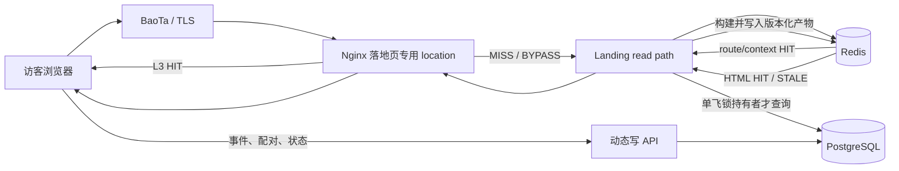

# Parloq Flow 落地页缓存与并发专项优化方案

> 状态：设计评审稿，仅做方案沉淀，暂未修改业务代码、数据库、Nginx 或生产环境。
> 调研时间：2026-08-24。
> Parloq 本地代码基线：`d1a4a76113922c7e28dcbddb2e0923ec47e128f2`。
> 参考项目：本机 LECMS、MACCMS10、MACCMS10-new；只提炼工程经验，不复制代码或业务实现。

## 1. 结论先行

Parloq 当前落地页非常适合缓存：同一渠道、语言和流量类型下，渲染结果不包含访客 IP、设备指纹、号码、配对令牌或随机值，真正的访客数据都由页面加载后的公开接口处理。当前主要问题是每次 GET 都重新经过域名解析、数据库查询、语言包读取、HTML 正则替换、Pixel/策略/集成装配，并明确返回 `Cache-Control: no-store`。

建议采用“应用层版本化缓存为主、Nginx 短时微缓存为辅、静态资源内容寻址”的三段式方案：

1. 先在 API 内建立精确域名隔离的 Redis 渲染缓存，并用单飞锁解决缓存击穿。
2. 所有影响落地页的管理端写操作统一推进渠道的落地页发布版本；缓存键带版本，只新增新键，不扫描、通配删除或清空 Redis。
3. 将模板资源改成带内容版本或哈希的不可变 URL，逐步让 Nginx/CDN 直接承接图片、CSS、JS 和视频。
4. 应用缓存正确且可观测后，再为落地页 GET 增加 1～3 秒 Nginx 微缓存与 `cache lock`；不要一开始就上长 TTL 整页缓存。
5. 预览、事件上报、配对、状态查询、Meta 异常上报等请求保持不缓存，并与落地页读取并发隔离。

这套方案的核心不是“Redis 查得更快”，而是让高并发下绝大多数请求不访问 PostgreSQL、不重复渲染，并保证同一个冷键或过期键同时只有一个请求回源构建。

按现有生产测得的动态渲染安全量级约 150 QPS 计算：

- 1,000 外部 QPS、95% 命中率，只产生约 50 origin QPS；
- 5,000 外部 QPS、97% 命中率，产生约 150 origin QPS；
- 5,000 外部 QPS、99% 命中率，只产生约 50 origin QPS。

因此第一阶段不应承诺一个脱离命中率的固定 QPS。更合理的验收目标是：缓存命中率不低于 97%、回源渲染受控在 150 QPS 内，然后在生产等价环境验证 1,000 QPS 持续和 5,000 QPS 短时突发。5,000 QPS 是压测目标，不是未经验证的生产承诺。

## 2. 当前实现与瓶颈

### 2.1 当前请求链路

生产客户域名进入 `apps/web/nginx.production.conf` 的默认虚拟主机：

- `/{slug}` 被内部重写到 `/api/public/promotion/channels/{slug}/render`；
- `/{slug}/1` 被内部重写到裂变渲染路径；
- 页面、模板资源、事件与配对请求均由同一个 API 服务处理；
- 客户域名不能访问管理 SPA，这个隔离边界必须保持。

API 的当前渲染链路位于 `apps/api/app/routers/promotion.py`：

1. `_public_channel()` 按请求 host 查询并校验 `DomainRecord`，再按域名、子域名前缀和 slug 查询渠道。
2. 读取模板、Pixel、租户模板策略、模板语言 JSON 和启用的第三方集成。
3. 按 `Accept-Language`、渠道国家和模板支持语言解析最终 locale。
4. 对 HTML 做本地化、viewport、资源路径、runtime config 和集成脚本注入。
5. 按本次请求 origin 生成 CSP。
6. 返回 `Cache-Control: no-store`。

模板资源请求同样先解析渠道与域名，再从 PostgreSQL 读取二进制；CSS/JS 还会在每次请求中做路径替换。资源目前只有 300 秒浏览器缓存，没有内容哈希 URL、ETag 或 `immutable`。

### 2.2 当前并发结构

- 生产 API 是一个 Uvicorn 进程。
- SQLAlchemy 未显式配置连接池，使用默认池参数；典型上限约为常驻 5 加溢出 10，但应以运行配置为准。
- 页面读取、事件写入、配对启动和管理请求共享同一个 API 进程与数据库连接池。
- Nginx 当前没有 `proxy_cache`、请求合并、stale 策略或落地页专用限流。
- PostgreSQL、Redis 和宿主机资源目前并非主要瓶颈；动态请求首先受 Python 渲染、数据库往返、连接池和单进程共享影响。

### 2.3 已测基线

2026-08-24 在当时生产版本和小数据集上得到以下近似结果：

| 请求 | 并发 | 吞吐 | P95 |
| --- | ---: | ---: | ---: |
| `/healthz` | 10 | 约 1,627 QPS | 约 18 ms |
| `/readyz` | 10 | 约 889 QPS | 约 19 ms |
| 公开渠道 JSON | 10 | 约 360 QPS | 约 38 ms |
| 真实落地页渲染 | 10 | 约 246 QPS | 约 53 ms |
| 真实落地页渲染 | 30 | 约 229 QPS | 约 212 ms |

该数据集很小，不能代表未来大量租户、模板和事件数据下的稳定上限。它能说明两件事：

- 动态渲染已经明显慢于最轻 API；
- 并发提高时 P95 快速恶化，所以现状应按约 100～150 QPS 的动态业务稳态规划，而不是按 200 多 QPS 的短测峰值承诺。

## 3. 从本机参考项目学到什么

### 3.1 LECMS：编译产物、分片缓存和定向失效

参考仓库：`/Users/3fulieak/PhpstormProjects/lecms`，调研提交 `de4d363` 附近代码及相关历史提交。

值得借鉴：

- `runtime_model.class.php` 把配置与区块数据放入运行时缓存，并在一次请求内再做本地复用，避免同一个依赖被重复读取。
- 区块缓存键由所有会改变结果的参数构成，而不是只按页面路径缓存。
- 模板会先编译成可执行产物，仅在源文件变化或调试模式下重新生成，降低每次请求的解析成本。
- 全局 TTL 可以限制各区块自行设置的 TTL，避免某个模块错误地缓存太久。
- 域名批次上下文带显式版本号，并支持按域名或批次定向失效。
- 部署和配置写入后主动刷新运行时缓存，而不是只等自然过期。
- 不存在的数据也可短时缓存，减少持续的无效查询。

更重要的是它的历史缺陷：

- `7bbe5a5`、`1548fce` 连续修复了通配域名下绝对链接进入共享缓存后造成的 host 泄漏。
- `afd401d` 修正了请求 host URL 和 TTL 行为。
- 域名批次使用“根域名归一”方便共享，但会把本应不同的子域上下文合并。

Parloq 的适配结论：

- 学习“请求内复用、编译产物、完整参数键、版本化、负缓存、写后失效”。
- 不采用“根域名共享最终 HTML”。Parloq 的 `domain + subdomain_prefix + slug` 是授权边界，必须按精确、已验证的公开 host 隔离。
- 不采用 Redis `flushdb` 或通配扫描清缓存。
- 不照搬简单的 `SET` 后 `EXPIRE`、无锁重建和模糊的空值判断。

### 3.2 MACCMS10：微缓存、击穿保护和读写分流

参考仓库：

- `/Users/3fulieak/PhpstormProjects/maccms10`，提交 `f2ff88b`；
- `/Users/3fulieak/PhpstormProjects/maccms10-new`，提交 `64b80451` 附近代码。

值得借鉴：

- `PHP_NGINX_PERFORMANCE_PLAN.md` 把 Nginx 1～10 秒微缓存和 `fastcgi_cache_lock` 作为高收益项；缓存键必须包含 host，只缓存 GET/HEAD，并绕过后台、鉴权和写接口。
- `REQUEST_FIXED_COST_OPTIMIZATION_PLAN.md` 强调请求内缓存、缓存 miss 双检锁、精确数据库字段、模板编译缓存，以及把 gzip 等工作交给 Nginx。
- `Extend::dataCount()` 用文件锁加双重检查，阻止多个 PHP-FPM 进程同时重算昂贵聚合。
- 点击/来源计数先在 Redis 缓冲，再批量写 MySQL，避免高频小写争用主库。
- sitemap 生成静态文件，让 Nginx 直接服务；动态 sitemap 也缓存最终 XML。
- 404 路由映射加入进程内缓存、Redis 正缓存和负缓存，减少随机路径反复查库。
- 查询只取必要字段，并对昂贵聚合使用快照。

需要特别警惕：

- 页面缓存键曾按根域名归一，同样不适合 Parloq 的精确子域授权。
- PHP 应用层整页缓存仍需进入 PHP；Nginx 命中才能真正把请求挡在应用之外。
- 文件锁只适合单机共享文件系统；Parloq 后续多实例必须用 Redis 单飞锁和带 token 的安全释放。
- 仓库中一整套“Redis-only 数据路径 + 全量/增量预热”后来被连续回滚，说明把 Redis 当唯一读取真相、试图覆盖所有模板查询组合，正确性和维护成本很高。
- 性能文档中的部分 Nginx 项是规划，不等于所有环境都已部署；本方案只吸收设计原则。

Parloq 的适配结论：

- 使用 Redis 做可丢弃的派生缓存，不做业务事实来源。
- 使用跨进程单飞锁、双重检查和短时 stale，而不是本机文件锁。
- 高频事件写路径与页面读路径隔离，但本专项不改变事件业务语义。
- 静态资源和稳定脚本逐步静态化；最终 HTML 因语言、Pixel、策略、集成和 host 安全头不同，采用版本化动态产物，而不是离线生成一份通用 HTML。

## 4. 设计边界

### 4.1 可以缓存

- 生产客户域名上的直投落地页 HTML。
- 生产客户域名上的裂变落地页 HTML。
- 已解析的域名与渠道发布上下文。
- 模板语言包解析结果。
- 模板编译/本地化中间产物。
- 启用集成的只读运行时描述与 CSP 来源集合。
- 模板图片、字体、CSS、JS、视频和平台公开 runtime 脚本。
- 已知域名下不存在的 slug，以及未知/不可用域名的短时负结果。

### 4.2 永远不缓存

- 模板后台预览和带签名的预览资源。
- `POST .../events` 与裂变事件上报。
- 配对开始、取消、状态查询以及任何包含状态 Bearer token 的响应。
- Meta 域名异常上报、CAPI 探测、第三方集成反馈事件。
- 管理端 API、登录态响应、健康检查和就绪检查。
- 任何包含访客号码、设备指纹、IP、配对码、一次性 token 或管理端身份的响应。

### 4.3 必须保持的安全不变量

1. 缓存隔离使用“精确、规范化且已经授权的公开 host”，不能用根域名代替。
2. `Host` / `X-Forwarded-Host` 只有经过可信 BaoTa/Nginx 链路覆盖后才能参与缓存；应用应优先使用域名解析结果生成 canonical origin。
3. 相同 slug 在不同域名、子域、租户下绝不能命中同一最终响应。
4. 语言、直投/裂变、Pixel、策略、集成集合或模板版本不同，不能共享最终响应。
5. 预览或鉴权请求一旦出现，必须显式 `BYPASS`，不能先查公共缓存。
6. 缓存故障只能造成回源或限流，不能造成跨租户回退。

## 5. 目标架构



建议的缓存层次：

| 层 | 内容 | 目标 | 是否权威 |
| --- | --- | --- | --- |
| L0 请求内 | 同一次请求的渠道、模板、Pixel、策略、集成、语言包 | 消除重复查询 | 否 |
| L1 进程内 | 小容量、短 TTL、带发布版本的模板编译产物 | 降低 Redis 序列化与 HTML 重处理 | 否 |
| L2 Redis | 路由上下文、最终渲染 envelope、负缓存、单飞锁 | 跨进程复用与击穿保护 | 否 |
| L3 Nginx/CDN | 精确变体的短时完整响应；不可变资源长缓存 | 请求不进入 Python | 否 |
| PostgreSQL | 域名、渠道、模板、策略、Pixel、集成和发布版本 | 唯一业务事实来源 | 是 |

## 6. 发布版本与缓存键

### 6.1 不复用现有 `route_version`

`PromotionChannel.route_version` 当前用于协议节点/协议池路由变化，语义与落地页内容不同。缓存方案应新增独立的 `landing_revision` 或等价的持久化发布版本，禁止借用 `route_version`，否则协议切换和页面发布会相互污染。

### 6.2 推荐的持久发布版本

每个渠道维护单调递增的 `landing_revision`。所有会改变该渠道公开页面、资源可用性或安全头的写入，都在同一数据库事务内推进这个版本；事务提交成功后再发布缓存失效与预热消息。

推荐由一个集中服务负责：

- 判断一次管理写入影响哪些渠道；
- 在数据库事务内推进持久版本；
- 提交后发布失效消息、删除路由上下文键并预热热点变体；
- 失败时通过 outbox/重试任务补发失效，不依赖“某个路由里顺手删缓存”。

模板、租户策略或集成包可能影响多个渠道。当前渠道数量不大时可直接批量推进所有引用渠道；未来规模很大时，再拆为 channel/template/policy/integration 多级 revision 并计算依赖摘要，不需要一期过度设计。

### 6.3 canonical host

缓存前先得到：

```text
canonical_host = lower(IDNA(host_without_port)).rstrip('.')
```

随后必须用数据库/可信发布快照验证它对应的 `DomainRecord + subdomain_prefix`。不要使用临时推断出的根域名作为最终隔离键，也不要把未校验的请求头直接写入缓存响应的 CSP。

### 6.4 推荐键结构

以下是语义示例，不要求代码逐字采用：

```text
route_hash = sha256(canonical_host + "\0" + slug)

lp:route:v1:{route_hash}
  -> channel_id, landing_revision, domain_id, template_id,
     owner_id, pixel_id, country_code, in_app_browser_mode,
     supported_locales, default_locale, dependency_digest

lp:route-miss:v1:{route_hash}
  -> missing_domain | disabled_domain | missing_channel

lp:locale:v1:{template_id}:{template_revision}:{resolved_locale}
  -> 已校验的扁平语言字典

lp:artifact:v1:{template_id}:{template_revision}:{resolved_locale}:{policy_revision}
  -> 已本地化、已应用稳定模板策略、尚未绑定渠道运行时参数的中间产物

variant_hash = sha256(
  canonical_scheme + "\0" + canonical_host + "\0" + channel_id + "\0" +
  landing_revision + "\0" + resolved_locale + "\0" + traffic_source + "\0" +
  dependency_digest + "\0" + application_build_revision
)

lp:html:v2:{variant_hash}
  -> body, content_language, CSP source set, ETag, fresh_until, built_at

lp:lock:v1:{variant_hash}
  -> 随机 owner token，SET NX PX
```

最终键中显式加入 exact scheme/host 是防御性设计，因为当前 CSP 和 origin 会随请求变化。即使渠道 ID 理论上已唯一，也不省略这一维度。

不要把原始 `Accept-Language` 直接作为应用 HTML 缓存维度。先按模板支持语言解析成有限集合中的 `resolved_locale`，再使用它建键，可避免几乎等价的语言头制造大量重复缓存。

### 6.5 TTL 建议

| 对象 | 初始建议 | 说明 |
| --- | ---: | --- |
| 正向 route context | 60～300 秒 | 写后主动失效；TTL 仅作兜底 |
| 已知域名下不存在 slug | 5～15 秒 | 防随机路径查库，不长期保存 |
| 未知/不可用域名 | 2～5 秒 | 防止攻击者制造大量永久负键 |
| locale / artifact | 30～60 分钟 | 键带模板版本，旧键自然淘汰 |
| 最终 HTML fresh | 30～120 秒 | 写后通过版本立即切换，不靠 TTL 保鲜 |
| 最终 HTML stale 保留 | 额外 30～300 秒 | 只用于允许 stale 的软故障 |
| 单飞锁 | 2～5 秒 | 必须大于正常构建 P99，且有安全释放 |
| Nginx 微缓存 | 初始 1～3 秒 | 先限制撤销延迟，再按数据调优 |
| 内容寻址资源 | 1 年、immutable | URL 必须带版本/哈希 |

所有 TTL 增加 5%～15% 抖动，避免大量键在整点同步过期。

## 7. 命中、未命中与缓存击穿流程

### 7.1 正常请求

1. Nginx 只让落地页 GET/HEAD 进入缓存候选；其他方法直接绕过。
2. 规范化并验证 trusted scheme/host，识别直投或裂变路径。
3. 若是预览、管理域名、带预览参数或鉴权语义，标记 `BYPASS`。
4. 查询 route context；正向命中后得到渠道和 `landing_revision`，负向命中则快速返回对应 404。
5. 根据有限的支持语言集合解析 `resolved_locale`。
6. 查询最终 HTML envelope；fresh 命中直接返回。
7. miss 时尝试 `SET lock token NX PX`。
8. 获锁者再次检查 HTML 键，防止等待期间已被其他请求填充；仍 miss 才读取 PostgreSQL 并渲染。
9. 构建成功后原子写入带 TTL 的 envelope，再用比较 token 的 Lua 脚本释放锁。
10. 未获锁者优先返回同版本 stale；没有 stale 时只等待一个很短的有界窗口，再重查缓存，禁止每个等待者都回源。

### 7.2 单飞锁要求

- 锁值必须是随机 owner token，释放时比较 token，不能直接 `DEL`。
- 锁 TTL 必须兜底自动释放。
- 构建失败不能写入空 HTML 或长期负结果。
- 404 只有在域名/渠道解析明确成功或明确不存在时才按短 TTL 负缓存；数据库异常不能伪装成 404 缓存。
- 等待时间建议从 100～300 ms 起步，以实测冷构建 P99 调整。
- 同时限制全局冷构建数量，例如每个 API 进程 4～8 个；随机不同键也不能绕过单键锁拖垮数据库。

### 7.3 stale 使用边界

把失效分成两类：

- **软更新**：模板文案、图片、Pixel 映射、普通策略更新。可在短暂重建期间返回同渠道上一版本，允许秒级最终一致。
- **硬撤销**：域名禁用、验证失效、渠道停用、租户隔离变化、安全集成被禁用。必须推进版本并同步删除 route context；不能因 Redis/源站故障长期返回旧 200。

一期建议硬撤销不使用 stale，Nginx 也不配置 `error/timeout` 下无限返回旧页面。若未来引入 CDN 长缓存，硬撤销必须同时具备 purge/ban 能力。

## 8. 渲染产物应如何拆分

### 8.1 第一期：优先缓存最终 envelope

现阶段最容易正确落地的是缓存最终 HTML、`Content-Language`、ETag 和生成 CSP 所需的来源集合。完整键已经包含精确 scheme/host、渠道版本、语言和流量类型，因此安全边界清晰，收益也最大。

不要在第一期为了追求极致复用，把现有渲染器拆成大量细粒度区块。先让正确的最终缓存稳定工作，再根据 cold miss profile 决定是否增加 artifact 层。

### 8.2 第二期：共享模板中间产物

同一模板可能被多个渠道使用。可将以下稳定工作提前到 `artifact`：

- 读取并校验语言 JSON；
- 本地化静态文案和 `<html lang/dir>`；
- 应用不依赖渠道的 viewport 策略；
- 预解析模板中的资源引用位置。

以下内容仍在渠道绑定阶段完成：

- slug 与直投/裂变 URL；
- Pixel Dataset ID 和事件映射；
- 渠道国家、内嵌浏览器策略；
- active integrations、CSP 来源和集成 URL；
- exact origin 与响应安全头。

这吸收了 LECMS“先编译、后绑定”的优点，又避免把某个 host 的绝对链接写入共享模板缓存。

## 9. 写后失效矩阵

| 变化 | 影响 | 动作 |
| --- | --- | --- |
| 渠道 slug、域名、子域前缀、状态 | 路由授权和 URL | 硬失效；推进 revision；删新旧 route key；清 Nginx 微缓存 |
| 渠道国家、模板、Pixel、in-app mode | HTML/runtime/语言 | 推进该渠道 revision；预热默认语言 |
| 模板 ZIP、index、manifest、locale、资源、版本 | HTML 与资源 | 推进所有引用渠道 revision；生成新资源版本；预热热点渠道 |
| 模板状态 | 页面是否应继续服务 | 先明确产品语义；默认按硬失效处理 |
| 租户模板策略 | viewport、guard 配置、事件限流配置 | 推进租户下所有渠道 revision |
| Pixel enabled、dataset、browser 开关、event mapping | runtime 与注入行为 | 推进所有引用渠道 revision |
| 仅 CAPI token 或服务端投递重试参数 | 不改变公开 HTML | 不失效 HTML，除非公开 runtime 也依赖该字段 |
| 模板与集成绑定变化 | HTML、CSP、iframe/script | 推进引用该模板的渠道 revision |
| 集成 enabled、包版本、entrypoints、integrity、source domain | HTML、CSP、外部资源 | 推进所有受影响渠道 revision |
| 集成源域名或客户域名 readiness 变化 | 授权/CSP/资源可用性 | 硬失效 |
| tracker/guard 或渲染代码发布 | HTML 引用或转换语义 | 键包含 Git SHA；发布后新旧缓存天然隔离 |
| 事件、配对、访客、投放统计新增 | 与公开 HTML 无关 | 不失效页面缓存 |

规则必须在数据库提交成功后生效。事务回滚时不能提前让旧缓存失效；提交成功但 Redis 通知失败时，outbox/重试必须最终补偿。

## 10. Nginx 微缓存设计

应用缓存通过正确性验收后，再增加落地页专用 cache zone。原则如下：

- 只匹配两个短路径和两个明确的公开 render GET/HEAD 路径，不在通用 `/api/` location 上整体开启。
- `proxy_cache_lock on`，让同一 edge key 的并发 miss 只回源一次。
- 初始 TTL 1～3 秒，先观察硬撤销时延与命中率，再逐步调整。
- key 至少包含可信 public scheme、精确 public host、规范化渲染路径、直投/裂变和语言变体。
- 当前 HTML 不随 UTM、`fbclid` 等查询参数变化，营销查询参数不应制造不同 HTML 键；若未来出现内容型 query，只允许白名单参数参与键。
- 当前服务端按 `Accept-Language` 解析语言。edge 层无法天然得到 `resolved_locale`，一期可把原始语言头加入短时 key，应用 Redis 仍按归一后的 locale 复用。后续如引入显式 locale 路由或可信 locale cookie，再把 edge 变体压缩到有限集合。
- 不因普通 Cookie 自动绕过。Meta/浏览器 Cookie 可能普遍存在，但当前 HTML 不读取它们；应通过测试确认响应与 Cookie 无关，而不是用 Cookie 破坏全部命中率。
- 带 `Authorization`、管理域名、后台预览、开发预览参数一律 bypass。
- 在没有可靠 purge 前，不启用长时间 `use_stale error timeout`；硬撤销优先于旧页面可用性。

建议先让 Nginx 透传应用层 `X-Parloq-Cache`，并增加独立的 `X-Parloq-Edge-Cache`，方便区分 L2 和 L3 命中。

## 11. 模板资源专项优化

当前资源 URL 复用渠道 slug 和文件路径；模板替换后相同 URL 内容会改变，因此只能使用短 TTL。推荐改为内容寻址或至少版本寻址：

```text
/api/public/promotion/assets/{template_public_id}/{template_revision}/{sha256}/{path}
```

目标行为：

- `Cache-Control: public, max-age=31536000, immutable`；
- 强 ETag 或内容 SHA-256；
- Nginx/对象存储直接服务，不再为每张图或每个视频解析渠道并查 PostgreSQL；
- 同一模板被多个渠道使用时可共享资源缓存；
- CSS/JS 中的 `/assets/` 在模板发布阶段改写一次，不在每个请求中做二进制正则替换；
- Range 请求直接从文件或对象存储读取片段，避免先把整个视频二进制装入 Python 内存；
- `tracker.js`、`guard.js` 改为带构建哈希文件名，取消固定 URL + 300 秒缓存的发布等待。

模板资源本身是公开落地页产物，允许内容级共享；如果业务要求“域名停用后资源也立即不可访问”，则 CDN/Nginx key 仍需带 exact host，并为硬撤销提供 purge。该策略应在实施前明确，不能含糊处理。

## 12. 并发隔离与背压

缓存不能替代容量保护。建议同时加入：

1. **冷构建信号量**：限制每个进程和全局同时回源构建数，避免大量不同冷键绕过单飞锁。
2. **显式数据库预算**：按 API worker 数量显式设置 SQLAlchemy `pool_size/max_overflow/pool_timeout`，保证 API、worker 和网关总连接数不超过 PostgreSQL 预算。
3. **短超时**：Redis 获取、锁等待、数据库获取连接和渲染分别设置可观测超时；不要让请求无限排队。
4. **路径级限流**：有效落地页读取、随机 404、事件写入、配对开始分别使用不同阈值。未知 host/slug 的限制应更严格。
5. **独立 read service**：若应用缓存后 Python 仍是瓶颈，再把公开落地页 GET 拆成 `landing-api` 进程/服务，使用独立 Uvicorn worker 和只读连接池；不要先盲目增加现有 API worker。
6. **事件写入隔离**：页面 GET 高峰不能耗尽事件/配对所需的线程和连接；事件批量化是后续专项，不在本次缓存改造中混做。

Redis 故障时的建议降级：

- 小流量下允许直接回源渲染；
- 达到冷构建并发上限后快速返回 503/429 和短 `Retry-After`，不让请求无限堆积；
- 可使用带版本的小容量 L1 产物，但不能跨硬撤销继续服务；
- 绝不因 Redis 失败跳过域名/租户校验。

## 13. 可观测性

### 13.1 响应标记

建议统一：

```text
X-Parloq-Cache: HIT | MISS | STALE | BYPASS | NEGATIVE | LOCK_WAIT
X-Parloq-Edge-Cache: HIT | MISS | BYPASS
ETag: "<variant-or-content-hash>"
Vary: Accept-Language
```

生产是否对外暴露详细标记可配置，但内部日志必须保留。

### 13.2 指标

- landing requests、状态码、P50/P95/P99；
- L2/L3 hit ratio；
- route、locale、artifact、HTML 各层命中率；
- cold render duration 与各依赖查询耗时；
- lock acquired、lock wait、lock timeout、stale served；
- active cold builders、被背压请求数；
- Redis 错误/超时、数据库 pool checkout wait；
- 失效通知延迟、预热成功率、旧 revision 请求数；
- 资源缓存命中、回源字节、Range 请求和 Python 输出字节。

Prometheus 标签不能直接放 host、slug、channel ID 或完整 locale header，避免指标高基数。渠道级排查写结构化日志或采样事件。

### 13.3 正确性哨兵

自动化检查应对同一 slug 构造不同 host、语言、直投/裂变、Pixel、策略和集成组合，断言响应 body、CSP、`Content-Language` 与 key 均按预期隔离。任何跨 host 命中都按 P0 安全事故处理。

## 14. 压测与验收矩阵

不能只压一个热 URL。至少覆盖：

| 场景 | 目的 |
| --- | --- |
| 单 host、单 slug、单语言热键 | 验证最高命中吞吐和 edge 性能 |
| 单渠道多种常见 `Accept-Language` | 验证 locale 归一和变体命中 |
| 多 host 同 slug | 验证租户/域名隔离 |
| 直投与裂变同时访问 | 验证 traffic source 不串页 |
| 100% cold，不同合法渠道 | 测真实回源上限与数据库池 |
| 大量随机未知 host/slug | 测负缓存、限流和缓存污染防护 |
| 同一键同步过期，100/500 并发 | 验证单飞锁与 stale，无击穿 |
| 压测中更新模板/Pixel/策略/集成 | 验证写后失效和新版本可见性 |
| 域名/渠道停用时持续请求 | 验证硬撤销不返回旧 200 |
| Redis 慢、Redis 断开、PostgreSQL 慢 | 验证降级、背压和超时 |
| API/Nginx 重启和滚动发布 | 验证构建 SHA 隔离与缓存恢复 |
| 大图、CSS/JS、视频 Range | 验证资源不再压 Python/数据库 |
| 30～60 分钟 soak | 观察内存、连接、键数量和尾延迟 |

建议记录 0%、80%、95%、97%、99% 命中率下的外部 QPS、origin QPS 和 P99。只报告吞吐、不报告命中率和错误率的结果没有容量意义。

第一轮验收门槛：

- 不出现跨域名、跨租户、跨语言或直投/裂变串页；
- 热点 HTML L2 命中率 ≥ 97%；
- Nginx 开启后热点 L3 命中率 ≥ 95%；
- L2 HIT P95 < 25 ms，L3 HIT 在服务器回环 P95 < 10 ms；
- cold miss P95 < 150 ms；
- 同一冷键 500 并发时，实际 origin build 接近 1 次，而不是 500 次；
- 正常流量下 origin 渲染长期不超过 150 QPS；
- 模板发布后 5 秒内看到新版本，渠道/域名硬停用在约定撤销窗口内停止旧页面；
- 5xx < 0.1%，30 分钟无持续内存或数据库连接增长。

## 15. 分阶段落地

### 阶段 0：先补测量，不改变缓存语义

- 给渲染各阶段增加耗时和查询次数指标。
- 固化当前热键、冷键、随机 404 和多语言压测脚本。
- 记录模板大小、资源字节和每次页面所需 SQL 数。
- 确认 BaoTa 到 Nginx 的 `Host/X-Forwarded-Host/X-Forwarded-Proto` 覆盖链路，形成可信头边界。

退出条件：能回答一次请求时间花在哪里，且能复现现有约 100～150 QPS 稳态判断。

### 阶段 1：应用层正确性缓存

- 新增独立落地页缓存服务，不把缓存逻辑继续堆进 router。
- 引入 `landing_revision`、route context、短负缓存、最终 HTML envelope。
- 实现 Redis 单飞锁、双检、TTL 抖动和受控 stale。
- 集中接入所有写后失效点，补 outbox/重试。
- 预览和所有 POST 路径保持 bypass/no-store。

退出条件：缓存隔离、失效、故障注入测试全部通过；L2 热命中率达到目标。

### 阶段 2：不可变资源

- 模板和平台 runtime 资源 URL 带版本/哈希。
- 增加 ETag、`immutable` 和 Nginx/对象存储直出。
- 将 CSS/JS 资源路径改写前移到发布阶段。
- 视频 Range 不再经 Python 全量读库。

退出条件：二次访问资源基本不进入 API/PostgreSQL，模板发布不会读到旧资源。

### 阶段 3：Nginx 微缓存

- 只为明确落地页 GET/HEAD 开启 1～3 秒缓存。
- 启用 `proxy_cache_lock`，加入 edge 命中指标。
- 验证查询参数、Cookie、语言和硬撤销行为。
- 根据真实命中率逐步调整 TTL；没有 purge 能力前不做长缓存。

退出条件：达到 1,000 QPS 持续、5,000 QPS 短突发的初始目标，同时 origin QPS、错误率和 P99 在预算内。

### 阶段 4：按数据决定是否拆服务

只有出现以下证据才拆 `landing-api`：

- L3/L2 已高命中，但 Python 调度仍限制吞吐；
- 页面峰值明显干扰事件或配对；
- 单独扩展读 worker 能在数据库连接预算内获得明确收益。

## 16. 容量判断方式

外部容量与回源容量的关系近似为：

```text
origin_qps = external_qps × (1 - effective_hit_ratio)
```

以 150 origin QPS 安全预算为例：

| 外部 QPS | 有效命中率 | 预计 origin QPS | 判断 |
| ---: | ---: | ---: | --- |
| 1,000 | 85% | 150 | 刚到动态预算上限 |
| 1,000 | 95% | 50 | 有余量 |
| 5,000 | 95% | 250 | 不安全，需要更高命中或扩 origin |
| 5,000 | 97% | 150 | 刚到预算上限 |
| 5,000 | 99% | 50 | 有余量 |
| 10,000 | 99% | 100 | origin 可承受，但入口/TLS/网络尚需单独验证 |

有效命中率必须综合 L3 与 L2，而不是简单相加。随机攻击流量、首次语言变体、发布后的冷启动都会拉低命中率，所以还必须限制 cold builder 和未知路由。

对当前系统的阶段性判断：

- **未优化现状**：动态落地页建议按约 100～150 QPS 稳态规划。
- **仅 L2 应用缓存**：预计能显著提高吞吐并稳定尾延迟，但仍经过 Nginx、Python 和 Redis；应以 600～1,000 QPS 作为压测区间，不提前承诺。
- **L3 微缓存 + L2 + 不可变资源**：初始验收 1,000 QPS 持续、5,000 QPS 短突发；进一步容量由 TLS、带宽、页面大小、实际命中率和多域名分布决定。

## 17. 明确不做的事

- 不把 Redis 变成模板、渠道或域名的唯一事实来源。
- 不复制 LECMS/MACCMS 的代码、表结构或根域名缓存策略。
- 不用 `flushdb`、`KEYS` 或全量扫描作为常规失效方案。
- 不缓存事件、配对或带 token 的响应。
- 不用长 TTL 掩盖失效链路不完整的问题。
- 不先盲目增加 Uvicorn worker 或数据库连接数。
- 不因“静态化更快”把所有租户生成成难以撤销、难以审计的散落 HTML 文件。
- 不用一次单 URL 热键压测结果对外承诺系统 QPS。

## 18. 实施时建议的代码边界

后续真正开发时，建议形成独立模块，而不是在 `promotion.py` 中继续加入大量分支：

- `landing_publication`：计算受影响渠道、推进 revision、提交后失效与预热；
- `landing_cache`：键、序列化、fresh/stale、负缓存、单飞锁；
- `landing_renderer`：纯输入到渲染 envelope，尽量无数据库副作用；
- `landing_context`：精确 host/slug 授权解析和有限 locale 解析；
- `landing_metrics`：低基数指标和结构化日志。

先通过特性开关按渠道或租户灰度：`off -> observe -> l2 -> l2+edge`。回滚缓存时只关闭读写开关并恢复动态渲染，不回滚数据库业务数据，不删除模板、渠道或事件记录。

## 19. 调研依据

Parloq 主要依据：

- `apps/api/app/routers/promotion.py`
- `apps/api/app/services/promotion_integrations.py`
- `apps/api/app/models.py`
- `apps/api/app/database.py`
- `apps/web/nginx.production.conf`
- `deploy/docker-compose.production.yml`
- `apps/api/tests/test_business_modules.py`
- `apps/api/tests/test_promotion_integrations.py`
- `apps/api/tests/test_system_promotion_domains.py`

LECMS 主要依据：

- `lecms/model/runtime_model.class.php`
- `lecms/model/domain_batch_model.class.php`
- `lecms/xiunophp/cache/cache_redis.class.php`
- `lecms/xiunophp/lib/view.class.php`
- `lecms/block/block_list.lib.php`
- 历史提交 `958c544`、`3130ea3`、`c7f9e54`、`afd401d`、`7bbe5a5`、`1548fce`、`2ab4947`

MACCMS 主要依据：

- `PHP_NGINX_PERFORMANCE_PLAN.md`
- `REQUEST_FIXED_COST_OPTIMIZATION_PLAN.md`
- `MYSQL_CACHE_MISS_HEAVY_QUERIES.md`
- `application/common/controller/All.php`
- `application/common/model/Extend.php`
- `application/common/behavior/Init.php`
- `application/common/util/SitemapStatic.php`
- `application/index/controller/Rss.php`
- `404_traffic_mode_design.md`
- 性能提交与回滚序列 `9f8e566`、`211a024`、`e82e9eb`、`8337bae`、`150f85a` 及其后续 revert

最终方案以 Parloq 自身的域名授权、模板协议、语言、Pixel、第三方集成、预览安全和部署形态为准；参考项目只提供经验与反例。
